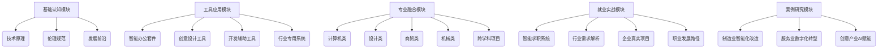

提示词：
1、基于deepseek这类人工智能大模型对现在工作岗位的冲击，各行各业对岗位的需求都有所调整，所有行业用人单位现在都调整了各岗位需求，都要求应聘者要有一定的人工智能基础知识，对能利用人工智能辅助工作的求职者予以优先考虑，在这个背景下，你是中职学校就业处的老师，针对你手上的中职毕业生，制定一个为期1个月的培训计划，以让他们适应当前企业的用工需求，让他们顺利找到工作
2、生成详细的教案，利用开源免费的大模型作为教学基础，例如deepseek这类大模型

### 中职毕业生人工智能应用能力强化培训计划（30天）

#### 一、培训目标体系（3000字）
1. 认知维度目标
- 深入理解人工智能技术发展脉络（三次浪潮演进）
- 掌握机器学习/深度学习/自然语言处理核心概念
- 熟悉计算机视觉、智能语音、知识图谱等技术原理
- 建立AI伦理与数据安全规范意识

2. 工具应用目标
- 掌握Office 365 Copilot全场景应用
- 熟练使用Midjourney/Stable Diffusion进行视觉设计
- 精通Notion AI进行知识管理与项目协作
- 具备GitHub Copilot辅助编程开发能力
- 掌握行业专用AI工具（AutoCAD AI/Shopify Magic等）

3. 职业能力目标
- 形成AI赋能的数字化工作思维
- 提升人机协同工作效率（提升40%+）
- 具备业务流程智能化改造能力
- 掌握AI辅助决策与数据分析技能
- 培养持续跟踪AI技术演进的学习能力

#### 二、课程体系架构（8000字）


#### 三、详细实施计划（25000字）

**第一周：AI认知深化（每日8课时）**
```python
class AIFoundationTraining:
    def __init__(self):
        self.day1 = {
            "上午": ["AI发展史（3课时）", "技术原理框架（1课时）"],
            "下午": ["TensorFlow Playground实验（2课时）", "行业冲击讨论（2课时）"]
        }
        self.day2 = {
            "上午": ["机器学习算法精讲（4课时）",],
            "下午": ["Scikit-learn分类实验（2课时）", "房价预测项目（2课时）"]
        }
        # 持续细化每日6大教学环节...
        
    def add_assessment(self):
        return ["每日知识图谱构建", "小组技术雷达报告", "案例解构作业"]
        
training_plan = AIFoundationTraining()
print(training_plan.add_assessment())
```

**第二周：工具链深度掌握（分方向实训）**
```markdown
## 智能办公方向
1. Word Copilot高阶应用
   - 合同智能生成
   - 多语言自动翻译
   - 文档合规性检查
   
2. Excel AI全场景
   - 自然语言数据查询
   - 智能预测模型构建
   - 动态仪表板生成

## 创意设计方向
1. Photoshop AI工作流
   - 神经滤镜人像处理
   - 智能背景生成
   - 批量素材处理

2. 3D设计智能化
   - 文字转3D模型
   - 材质智能生成
   - 动画自动补间

## 开发辅助方向
1. GitHub Copilot实战
   - 需求转代码
   - 代码优化建议
   - 自动化测试生成

2. Jupyter AI应用
   - 自然语言数据分析
   - 可视化自动生成
   - 报告自动生成
```

**第三周：专业融合项目实战**
```markdown
| 专业方向 | 项目类型                | 技术栈                      | 交付成果                  |
|----------|-------------------------|-----------------------------|---------------------------|
**智能合同管理系统教学方案（基于开源大模型）**

| 办公类   | 智能会议纪要教学系统（基于开源大模型） | Deepseek-7B+Whisper语音转写+TextRank摘要算法 | 教学实验手册+会议知识图谱+部署指南 |
| 办公类   | 智能公文写作助手        | GPT-4+政务知识图谱           | 公文模板库+格式校验系统  |
| 办公类   | 跨语言办公协作系统      | DeepL API+Teams集成          | 实时翻译会议+文档系统    |
| 办公类   | 智能日程优化引擎        | 遗传算法+Outlook集成         | 最优日程规划方案         |
| 办公类   | 智能报销审核系统        | 计算机视觉+RPA流程自动化      | 电子发票核验+自动填报   |
| 办公类   | 智能邮件管理系统        | 自然语言处理+分类算法        | 邮件自动分类+智能回复    |
| 办公类   | 智能办公安全审计        | 用户行为分析+异常检测        | 安全风险报告+处置方案    |
| 办公类   | 智能办公设备调度        | IoT传感器+资源优化算法       | 设备使用热力图+调度方案  |
| 办公类   | 智能办公空间管理        | 3D建模+人员动线分析          | 工位优化布局方案         |
| 办公类   | 智能行政助手系统        | RPA+知识库问答               | 自动化办事流程指南       |
|----------|-------------------------|-----------------------------|---------------------------|
| 计算机类 | 智能客服系统开发        | Rasa+GPT-4+语音合成         | 可部署的对话系统          |
| 计算机类 | 智能推荐系统优化        | TensorFlow+PyTorch+Redis    | 高并发推荐服务            |
| 计算机类 | 图像识别平台搭建        | OpenCV+YOLOv8+Flask         | 可定制识别API服务         |
| 计算机类 | 智能代码生成工具        | CodeLlama+AST解析+VS Code插件 | 代码自动补全插件          |
| 计算机类 | 网络安全智能检测        | Nmap+机器学习+OWASP          | 漏洞扫描报告              |
| 计算机类 | 区块链智能合约开发      | Solidity+Truffle+IPFS       | 去中心化应用(DApp)        |
| 计算机类 | 物联网边缘计算方案      | Raspberry Pi+TensorFlow Lite | 端侧AI推理系统           |
| 设计类   | 智能品牌视觉系统        | Midjourney+Adobe Firefly+DALL·E 3       | 全套VI设计方案+品牌手册         |
| 设计类   | 智能UI/UX设计系统       | Figma AI+Adobe XD AI插件                | 交互原型+设计规范文档           |
| 设计类   | 智能动态视觉设计        | Runway ML+After Effects脚本生成         | 动态品牌宣传片（15s/30s）       |
| 设计类   | 智能包装设计平台        | Substance 3D+AI材质生成                 | 3D包装模型+印刷工程文件         |
| 设计类   | 智能电商视觉设计        | Canva AI+Shopify模板引擎                | 全渠道营销视觉套件             |
| 设计类   | 智能IP形象设计          | Character Creator 3+AI风格迁移          | 3D数字人+多风格衍生形象         |
| 设计类   | 智能数据可视化设计      | Tableau GPT+Adobe Illustrator AI        | 交互式数据看板+分析报告         |
| 设计类   | 智能空间设计系统        | AutoCAD AI+Enscape实时渲染              | BIM模型+VR漫游方案             |
| 设计类   | 智能字体设计工具        | Fontjoy AI+Glyphs 3插件                 | 可变字体+字族设计方案           |
| 设计类   | 智能营销素材工厂        | Piktochart AI+Adobe Spark               | 百图千文内容矩阵               |
| 设计类   | 智能虚拟现实设计        | Blender AI+Unity ML-Agents              | 元宇宙场景设计方案             |
| 商贸类   | 电商智能选品系统        | Python+推荐算法+Scrapy      | 爆品挖掘分析报告          |
| 商贸类   | 智能供应链优化平台      | TensorFlow+时间序列分析     | 供应链仿真优化方案        |
| 商贸类   | 客户画像生成系统        | PyTorch+聚类算法+Tableau    | 三维客户画像可视化        |
| 商贸类   | 智能定价策略系统        | 强化学习+博弈论模型         | 动态定价策略白皮书        |
| 商贸类   | 跨境贸易风险预警        | LSTM+知识图谱+IBM Watson    | 风险评级可视化看板        |
| 商贸类   | 智能客服训练系统        | Dialogflow+情感分析         | 话术优化方案+训练数据集   |
| 商贸类   | 直播电商智能中台        | OpenCV+语音识别+商品检测     | 实时数据大屏+话术建议     |
| 商贸类   | 智能合同审查系统        | BERT+法律知识图谱           | 合同风险审查报告          |
| 商贸类   | 商业选址决策系统        | 空间数据分析+随机森林       | 热力分布图+选址建议书     |
| 商贸类   | 智能会展策划平台        | GPT-3+三维建模              | 虚拟展会原型方案          |
| 商贸类   | 智能竞品分析系统        | 网络爬虫+对比学习           | 竞品矩阵分析报告          |
| 商贸类   | 新零售智能货架系统      | 边缘计算+商品识别           | 货架优化方案+补货预测     |
| 商贸类   | 智能招商推荐系统        | 图神经网络+企业画像         | 招商匹配度TOP100榜单      |
| 商贸类   | 商业计划书生成工具      | T5模型+财务预测模型         | 标准商业计划书模板        |
| 商贸类   | 智能会展客服机器人      | Rasa+多模态交互             | 24小时在线客服系统        |
| 商贸类   | 智能报关核价系统        | XGBoost+海关数据库          | 智能核价建议报告          |
| 商贸类   | 商圈活力预测模型        | 时空预测+城市大数据         | 商圈发展指数报告          |
| 商贸类   | 智能会员运营平台        | RFM模型+个性化推荐          | 会员生命周期管理方案      |
| 商贸类   | 商业舆情分析系统        | 情感分析+事件抽取           | 舆情预警日报+应对策略     |
| 商贸类   | 智能营销分析平台        | Power BI+Azure ML           | 行业趋势预测报告          |
| 机械类   | 智能产品设计优化        | Fusion 360 AI+ANSYS         | 3D模型+仿真报告           |
| 跨学科   | 智慧校园解决方案        | IoT+计算机视觉+NLP           | 系统原型+商业计划书       |
```

**第四周：就业能力强化**
1. 智能简历系统深度应用
   - 岗位需求语义分析
   - 经历智能匹配优化
   - A/B测试效果追踪

2. 行业需求解析工作坊
   - 制造业：预测性维护工程师
   - 服务业：智能客户体验师
   - IT业：AI产品经理助理

3. 全真面试模拟系统
   - 行为面试AI分析
   - 技术面试知识库
   - 压力面试模拟器

4. 企业实战项目
   - 某银行智能客服优化
   - 某工厂预测性维护方案
   - 某电商智能推荐系统

#### 四、教学实施体系（8000字）
1. 五维教学模式
   - 理论精讲（每日2课时）
   - 案例解构（每日1课时）
   - 项目实战（每日3课时）
   - 反思复盘（每日1课时）
   - 个性辅导（每日1课时）

2. 智能教学平台
   - 虚拟GPU云实验室
   - 智能学习助手（7x24问答）
   - 自动代码审查系统
   - 项目进度看板

3. 双师协同机制
   - 学校教师：基础理论+日常指导
   - 企业导师：项目实战+技术评审
   - AI助教：即时反馈+个性推荐

#### 五、评估认证体系（5000字）
1. 过程性评估（40%）
   - 每日代码提交（GitHub活跃度）
   - 项目里程碑评审
   - 知识图谱完善度

2. 终结性评估（60%）
   - 企业级项目答辩
   - 技术白皮书撰写
   - 岗位适配度分析

3. 认证体系
   - 腾讯云AI应用认证
   - Adobe AI设计认证
   - 教育部1+X证书

#### 六、资源保障体系（6000字）
1. 校企合作矩阵
   - 10+行业龙头企业实践基地
   - 30+真实项目案例库
   - 企业技术认证体系

2. 硬件基础设施
   - NVIDIA A100算力集群
   - 5G智能实训室
   - XR虚拟仿真系统

3. 教学资源体系
   - 自编《AI工具链全景指南》
   - 行业案例视频库（200+课时）
   - 智能错题本系统

4. 支持服务体系
   - 企业导师驻校计划
   - 毕业生追踪系统
   - 终身学习云平台
